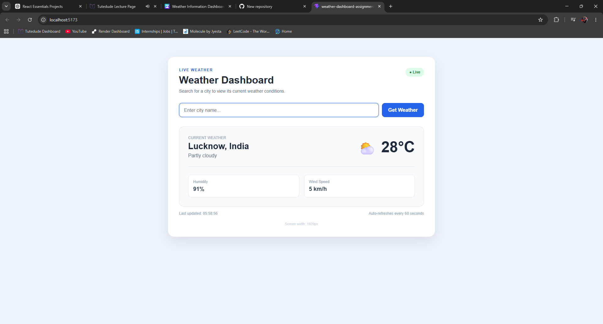

# Weather Information Dashboard 🌤️

A responsive Weather Information Dashboard built using React that fetches live weather information from an external API.

This project was created as part of the TuteDude React assignment to practise React's `useEffect` hook, API fetching, dependency management, cleanup functions, and side-effect handling.

## Features

- Search weather by city name
- Default weather for Lucknow on page load
- Fetch live weather data
- Display current temperature
- Display weather condition
- Display humidity
- Display wind speed
- Dynamic weather icons
- Loading state while fetching data
- Error handling
- City-not-found handling
- Automatic weather refresh every 60 seconds
- Last updated timestamp
- Responsive design for mobile and desktop

## Technologies Used

- React
- JavaScript
- CSS
- Vite
- Open-Meteo API

## React Concepts Used

This project demonstrates:

- `useState`
- `useEffect`
- Props
- Components
- Conditional rendering
- Event handling
- Async/Await
- Fetch API
- Dependency arrays
- Cleanup functions
- Multiple `useEffect` hooks

## useEffect Implementation

### 1. Weather Data Fetching

The main `useEffect` fetches weather data whenever the selected city changes.

```js
useEffect(() => {
  // Fetch weather information
}, [selectedCity])
```

Using `selectedCity` as a dependency ensures that weather data is fetched only when the selected city changes.

Typing into the search field does not trigger unnecessary API requests.

### 2. Default City

The application starts with Lucknow as the default selected city.

```js
const [selectedCity, setSelectedCity] = useState("Lucknow")
```

This causes the weather-fetching effect to execute when the application initially loads.

### 3. API Request Cleanup

The application uses `AbortController` to cancel unfinished API requests when the effect is cleaned up.

```js
const controller = new AbortController()

return () => {
  controller.abort()
}
```

This prevents outdated requests from unnecessarily updating the application.

### 4. Automatic Weather Refresh

Weather information automatically refreshes every 60 seconds using `setInterval`.

```js
const intervalId = setInterval(() => {
  fetchWeather()
}, 60000)
```

The interval is removed during effect cleanup.

```js
clearInterval(intervalId)
```

### 5. Event Listener Cleanup

A separate `useEffect` handles browser resize events.

```js
useEffect(() => {
  const handleResize = () => {
    setWindowWidth(window.innerWidth)
  }

  window.addEventListener("resize", handleResize)

  return () => {
    window.removeEventListener("resize", handleResize)
  }
}, [])
```

This demonstrates how event listeners should be properly cleaned up when a component is unmounted.

## Side Effects Demonstrated

The application demonstrates several common React side effects:

- External API requests
- Asynchronous data fetching
- Dependency-based effects
- Conditional fetching
- Multiple `useEffect` hooks
- API request cancellation
- Timer creation and cleanup
- Event listener creation and cleanup
- Automatic data refreshing

## Weather Information

For each city, the application displays:

- City and country
- Current temperature
- Weather condition
- Humidity
- Wind speed
- Weather icon
- Last updated time

## Project Structure

```text
weather-dashboard-assignment/
│
├── screenshots/
│   └── weather-dashboard.png
│
├── src/
│   ├── components/
│   │   ├── SearchBar.jsx
│   │   ├── WeatherCard.jsx
│   │   └── WeatherDetails.jsx
│   │
│   ├── App.jsx
│   ├── App.css
│   ├── index.css
│   └── main.jsx
│
├── README.md
├── package.json
├── vite.config.js
└── index.html
```

## Screenshot



## Getting Started

### 1. Clone the Repository

```bash
git clone YOUR_GITHUB_REPOSITORY_URL
```

### 2. Navigate to the Project

```bash
cd weather-dashboard-assignment
```

### 3. Install Dependencies

```bash
npm install
```

### 4. Start the Development Server

```bash
npm run dev
```

Open the local URL displayed by Vite in your browser.

## Production Build

Create a production build using:

```bash
npm run build
```

The production files will be generated inside the `dist` directory.

## API

Weather data is provided by the Open-Meteo weather and geocoding APIs.

No API key is required for this project.

## Error Handling

The application handles cases such as:

- Invalid city names
- City not found
- Failed weather requests
- Cancelled API requests

Users receive an appropriate error message when weather information cannot be retrieved.

## Live Deployment

Live Demo: https://weather-dashboard-assignment-rouge.vercel.app

## GitHub Repository

Repository: https://github.com/ABDUL-Malik897/weather-dashboard-assignment.git

## Assignment

**TuteDude – Weather Information Dashboard using useEffect, API Fetching & Side-Effect Management**

The objective of this assignment is to demonstrate practical knowledge of React side effects using `useEffect`, including dependency management, API fetching, cleanup functions, and advanced effect patterns.

## Author

**Abdul**
